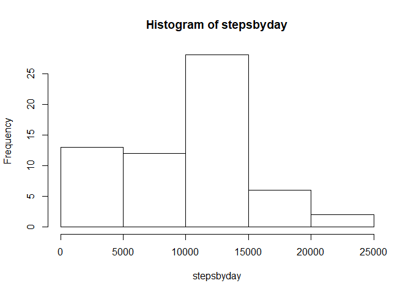
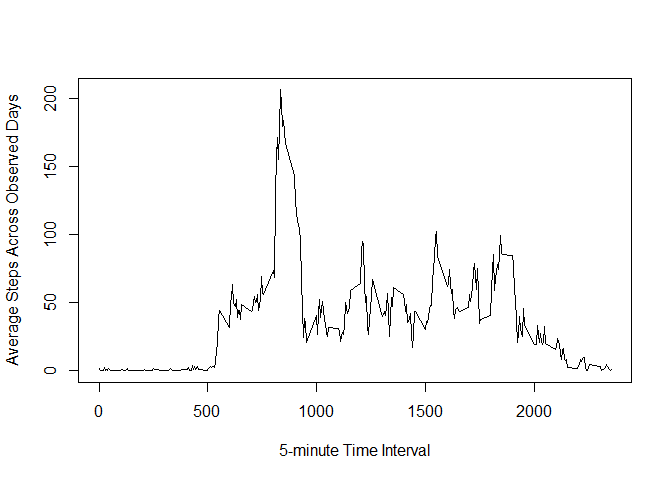
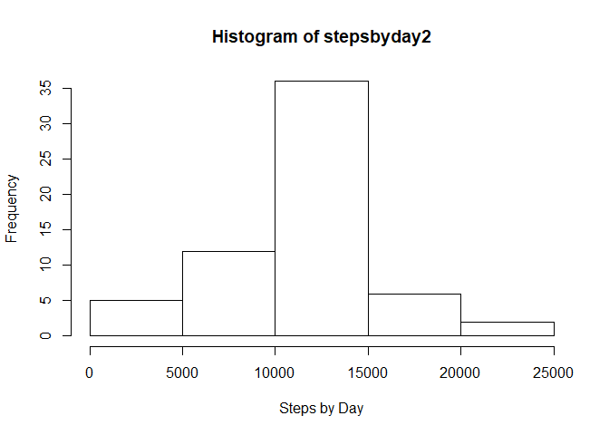
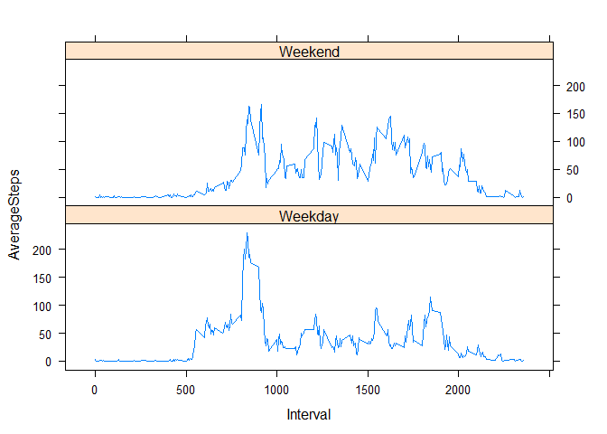

## Loading and preprocessing the data 

After loading the data using read.csv(), we transform the $date column of the data into class 'date' using as.date() for later use in creating the plots for analysis:


```r
unzip("activity.zip")
data <- read.csv("activity.csv")
data$date <- as.Date(as.character(data$date))
```

## What is mean total number of steps taken per day?

First, we will determine the # of steps taken on each observed day within the dataset:

```r
stepsbyday <- with(data,tapply(data$steps,data$date,sum, na.rm = T))
```

Next, we can create a histogram of the resulting data (i.e., the sum of steps taken per each observed day):

```r
hist(stepsbyday)
```

<!-- -->

Lastly, we can determine the mean and median of the total number of steps taken per day by using the tapply and mean/median functions:

```r
means <- with(data,tapply(data$steps,data$date,mean, na.rm = TRUE))
means
```

```
## 2012-10-01 2012-10-02 2012-10-03 2012-10-04 2012-10-05 2012-10-06 
##        NaN  0.4375000 39.4166667 42.0694444 46.1597222 53.5416667 
## 2012-10-07 2012-10-08 2012-10-09 2012-10-10 2012-10-11 2012-10-12 
## 38.2465278        NaN 44.4826389 34.3750000 35.7777778 60.3541667 
## 2012-10-13 2012-10-14 2012-10-15 2012-10-16 2012-10-17 2012-10-18 
## 43.1458333 52.4236111 35.2048611 52.3750000 46.7083333 34.9166667 
## 2012-10-19 2012-10-20 2012-10-21 2012-10-22 2012-10-23 2012-10-24 
## 41.0729167 36.0937500 30.6284722 46.7361111 30.9652778 29.0104167 
## 2012-10-25 2012-10-26 2012-10-27 2012-10-28 2012-10-29 2012-10-30 
##  8.6527778 23.5347222 35.1354167 39.7847222 17.4236111 34.0937500 
## 2012-10-31 2012-11-01 2012-11-02 2012-11-03 2012-11-04 2012-11-05 
## 53.5208333        NaN 36.8055556 36.7048611        NaN 36.2465278 
## 2012-11-06 2012-11-07 2012-11-08 2012-11-09 2012-11-10 2012-11-11 
## 28.9375000 44.7326389 11.1770833        NaN        NaN 43.7777778 
## 2012-11-12 2012-11-13 2012-11-14 2012-11-15 2012-11-16 2012-11-17 
## 37.3784722 25.4722222        NaN  0.1423611 18.8923611 49.7881944 
## 2012-11-18 2012-11-19 2012-11-20 2012-11-21 2012-11-22 2012-11-23 
## 52.4652778 30.6979167 15.5277778 44.3993056 70.9270833 73.5902778 
## 2012-11-24 2012-11-25 2012-11-26 2012-11-27 2012-11-28 2012-11-29 
## 50.2708333 41.0902778 38.7569444 47.3819444 35.3576389 24.4687500 
## 2012-11-30 
##        NaN
```


```r
medians <- with(data,tapply(data$steps,data$date,median))
medians
```

```
## 2012-10-01 2012-10-02 2012-10-03 2012-10-04 2012-10-05 2012-10-06 
##         NA          0          0          0          0          0 
## 2012-10-07 2012-10-08 2012-10-09 2012-10-10 2012-10-11 2012-10-12 
##          0         NA          0          0          0          0 
## 2012-10-13 2012-10-14 2012-10-15 2012-10-16 2012-10-17 2012-10-18 
##          0          0          0          0          0          0 
## 2012-10-19 2012-10-20 2012-10-21 2012-10-22 2012-10-23 2012-10-24 
##          0          0          0          0          0          0 
## 2012-10-25 2012-10-26 2012-10-27 2012-10-28 2012-10-29 2012-10-30 
##          0          0          0          0          0          0 
## 2012-10-31 2012-11-01 2012-11-02 2012-11-03 2012-11-04 2012-11-05 
##          0         NA          0          0         NA          0 
## 2012-11-06 2012-11-07 2012-11-08 2012-11-09 2012-11-10 2012-11-11 
##          0          0          0         NA         NA          0 
## 2012-11-12 2012-11-13 2012-11-14 2012-11-15 2012-11-16 2012-11-17 
##          0          0         NA          0          0          0 
## 2012-11-18 2012-11-19 2012-11-20 2012-11-21 2012-11-22 2012-11-23 
##          0          0          0          0          0          0 
## 2012-11-24 2012-11-25 2012-11-26 2012-11-27 2012-11-28 2012-11-29 
##          0          0          0          0          0          0 
## 2012-11-30 
##         NA
```

## What is the average daily activity pattern?
To visualize the average daily activity pattern, we can average the steps across all observed days for each 5-minute interval and graph the means in a time-series plot. First, we calculate the average steps taken within each 5-minute interval across all observed days by using the tapply function coupled with the mean function:

```r
z <- with(data,tapply(data$steps,data$interval,mean,na.rm = T))
```
Then, we create a plot using the names of the 'z' variable (aka. the 5-minute intervals) and the mean steps taken within each interval across all days ('z'):


```r
plot(names(z),z,type = "l", xlab = "5-minute Time Interval", ylab = "Average Steps Across Observed Days")
```

<!-- -->

To determine the 5-minute interval with the maximum mean number of steps, we can use the following code: 

```r
names(z[match(max(z),z)])
```

```
## [1] "835"
```

## Imputing missing values
1 - The total number of missing values in the dataset can be calculated using the following code: 

```r
sum(is.na(data$steps))
```

```
## [1] 2304
```

2 & 3 - The chosen strategy for imputing missing values will be to use the mean for the 5-minute intervals calculated across all observed days (aka. the 'z' vector calculated above). We can use the data.table package to accomplish this with the folowing code: 

```r
library(data.table)
data2 <- as.data.table(data)
data2[,m:= {tmp <- match(data2$interval,names(z)); z[tmp]}]

data2$n[is.na(data2$steps) ] <- data2$m[is.na(data2$steps)]
data2$n[!is.na(data2$steps) ] <- data2$steps[!is.na(data2$steps)]
```

The first line of code simply loads the data table package. 

The second line of code creates a new dataset 'data2' by reading the original data set using as.data.table.  

The third line of code creates a new column 'm' and, using a temporary variably 'tmp', matches the $interval column to the names of the 'z' vector in order to obtain the position of each variable within the 'z' vector. 
Next, using this temporary variable 'tmp', we set the 'm' column equal to the subset of z[tmp] to obtain the average steps taken per each 5-minute interval across all observed days. 

In the final 2 lines of code:  
1) In a new column 'n' with lines that are NA, set equal to the value calculated in column 'm'.  
2) In the new column 'n' with lines that are not NA, set equal to the value already existing in 'steps' column.  


4 - We can make a histogram of the total number of steps taken each day by using the followin code: 

```r
stepsbyday2 <- with(data2,tapply(data2$n,data2$date,sum, na.rm = T))
hist(stepsbyday2, xlab = "Steps by Day")
```

<!-- -->

The mean of steps per day is calculated as follows: 

```r
means2 <- with(data2,tapply(data2$n,data2$date,mean, na.rm = T))
means2
```

```
## 2012-10-01 2012-10-02 2012-10-03 2012-10-04 2012-10-05 2012-10-06 
## 37.3825996  0.4375000 39.4166667 42.0694444 46.1597222 53.5416667 
## 2012-10-07 2012-10-08 2012-10-09 2012-10-10 2012-10-11 2012-10-12 
## 38.2465278 37.3825996 44.4826389 34.3750000 35.7777778 60.3541667 
## 2012-10-13 2012-10-14 2012-10-15 2012-10-16 2012-10-17 2012-10-18 
## 43.1458333 52.4236111 35.2048611 52.3750000 46.7083333 34.9166667 
## 2012-10-19 2012-10-20 2012-10-21 2012-10-22 2012-10-23 2012-10-24 
## 41.0729167 36.0937500 30.6284722 46.7361111 30.9652778 29.0104167 
## 2012-10-25 2012-10-26 2012-10-27 2012-10-28 2012-10-29 2012-10-30 
##  8.6527778 23.5347222 35.1354167 39.7847222 17.4236111 34.0937500 
## 2012-10-31 2012-11-01 2012-11-02 2012-11-03 2012-11-04 2012-11-05 
## 53.5208333 37.3825996 36.8055556 36.7048611 37.3825996 36.2465278 
## 2012-11-06 2012-11-07 2012-11-08 2012-11-09 2012-11-10 2012-11-11 
## 28.9375000 44.7326389 11.1770833 37.3825996 37.3825996 43.7777778 
## 2012-11-12 2012-11-13 2012-11-14 2012-11-15 2012-11-16 2012-11-17 
## 37.3784722 25.4722222 37.3825996  0.1423611 18.8923611 49.7881944 
## 2012-11-18 2012-11-19 2012-11-20 2012-11-21 2012-11-22 2012-11-23 
## 52.4652778 30.6979167 15.5277778 44.3993056 70.9270833 73.5902778 
## 2012-11-24 2012-11-25 2012-11-26 2012-11-27 2012-11-28 2012-11-29 
## 50.2708333 41.0902778 38.7569444 47.3819444 35.3576389 24.4687500 
## 2012-11-30 
## 37.3825996
```


The median of steps per day is calculated as follows: 

```r
medians2 <- with(data,tapply(data2$n,data2$date,median, na.rm = T))
medians2
```

```
## 2012-10-01 2012-10-02 2012-10-03 2012-10-04 2012-10-05 2012-10-06 
##   34.11321    0.00000    0.00000    0.00000    0.00000    0.00000 
## 2012-10-07 2012-10-08 2012-10-09 2012-10-10 2012-10-11 2012-10-12 
##    0.00000   34.11321    0.00000    0.00000    0.00000    0.00000 
## 2012-10-13 2012-10-14 2012-10-15 2012-10-16 2012-10-17 2012-10-18 
##    0.00000    0.00000    0.00000    0.00000    0.00000    0.00000 
## 2012-10-19 2012-10-20 2012-10-21 2012-10-22 2012-10-23 2012-10-24 
##    0.00000    0.00000    0.00000    0.00000    0.00000    0.00000 
## 2012-10-25 2012-10-26 2012-10-27 2012-10-28 2012-10-29 2012-10-30 
##    0.00000    0.00000    0.00000    0.00000    0.00000    0.00000 
## 2012-10-31 2012-11-01 2012-11-02 2012-11-03 2012-11-04 2012-11-05 
##    0.00000   34.11321    0.00000    0.00000   34.11321    0.00000 
## 2012-11-06 2012-11-07 2012-11-08 2012-11-09 2012-11-10 2012-11-11 
##    0.00000    0.00000    0.00000   34.11321   34.11321    0.00000 
## 2012-11-12 2012-11-13 2012-11-14 2012-11-15 2012-11-16 2012-11-17 
##    0.00000    0.00000   34.11321    0.00000    0.00000    0.00000 
## 2012-11-18 2012-11-19 2012-11-20 2012-11-21 2012-11-22 2012-11-23 
##    0.00000    0.00000    0.00000    0.00000    0.00000    0.00000 
## 2012-11-24 2012-11-25 2012-11-26 2012-11-27 2012-11-28 2012-11-29 
##    0.00000    0.00000    0.00000    0.00000    0.00000    0.00000 
## 2012-11-30 
##   34.11321
```

To determine the impact of imputing the missing data, we can simply compare the total sum of means and medians vs. the new total sum of means and medians after imputing the data: 

```r
sum(means2,na.rm = TRUE) - sum(means, na.rm = TRUE)
```

```
## [1] 299.0608
```


```r
sum(medians2,na.rm=TRUE) - sum(medians2,na.rm=TRUE)
```

```
## [1] 0
```

## Are there differences in activity patterns between weekdays and weekends?
To answer this, we can create a new column in the data2 set to identify the day of the week for each line, then convert those days of the week into either "Weekday" or "Weekend":

```r
data2[,w:= weekdays(data$date)]
```
To convert the column 'w' into "Weekday" or "weekend", we use grep() to find the strings "Saturday" or "Sunday" in column 'w'. Using this index vector, we subset the data2$w and convert the values within the grep() rows to "Weekend" and the rest as "Weekday": 

```r
weekendindex <- grep("S(unday|aturday)",data2$w)
data2$w[weekendindex] <- "Weekend"
data2$w[data2$w != "Weekend"] <- "Weekday"
data2$w <- as.factor(data2$w)
str(data2$w)
```

```
##  Factor w/ 2 levels "Weekday","Weekend": 1 1 1 1 1 1 1 1 1 1 ...
```


To determine the average number of steps taken, averaged across either weekdays or weekends, we first have to split the dataset based on Weekends or weekdays: 

```r
weekdayset <- split(data2,data2$w)$Weekday
weekendset <- split(data2,data2$w)$Weekend
```
Next, we determine the mean steps taken for each 5-minute interval across all days within both weekday and weekend sets: 

```r
meanperweekday <- with(weekdayset,tapply(weekdayset$n, weekdayset$interval,mean, na.rm=TRUE)) 
meanperweekend <- with(weekendset,tapply(weekendset$n, weekendset$interval,mean, na.rm=TRUE)) 
```

Now, we can create a data frame (for plotting purposes) by creating a weekendset, weekdayset, and rbinding both together:

```r
weekday <- cbind(as.numeric(names(meanperweekday)),meanperweekday,"Weekday")
weekend <- cbind(as.numeric(names(meanperweekend)),meanperweekend,"Weekend")
final <- as.data.table(rbind(weekday,weekend))
names(final) <- c("Interval", "AverageSteps", "Day")
final$Interval <- as.numeric(final$Interval)
final$AverageSteps <- as.numeric(final$AverageSteps)
final$Day <- as.factor(final$Day)
```


Using the lattice plotting system, we can create a plot for the average steps taken across all days based on the newly created data table (Weekday or Weekend): 

```r
library(lattice)
xyplot(AverageSteps ~ Interval | Day, data = final, layout = c(1,2), type = "l")
```

<!-- -->
